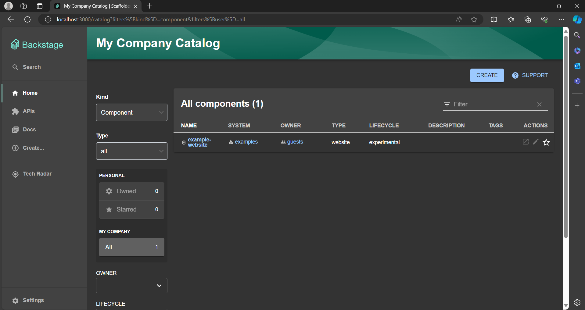

## Resumo do Material:

**Barema:**

(De 0 a 4) Documentação do processo de compilação e execução da ferramenta disponibilizada em arquivo markdown dedicado à gestão de configuração.
(De 0 a 3) Clareza na documentação, com passo a passo detalhado e que possibilite a replicação posterior.
(De 0 a 3) Evidência da aplicação sendo executada com prints no arquivo markdown.

Primeiro, o que é e qual é a função do backstage?
- O backstage produz ferramentas para construir imagens no docker, mas pode ser “deployed” com ou sem Docker em muitas infraestruturas diferentes

Para resolução da atividade, primeiro seguimos o link: https://backstage.io/docs/getting-started/

Para que pudéssemos criar um app "my-backstage-ap" e, em sequência, fazer seu upload no docker. 
Durante esse processo de criação, pudemos entender um pouco da sua estrutura de pastas, e, por consequência, da estrutura como um todo.

Para criar o projeto: 
```
npx @backstage/create-app@latest
```

O que iria criar um arquivo com essa estrutura:


Que poderia ser rodado com um 

```
yarn dev
```

Nos dando essa tela:



No entanto ela encontra-se em localhost.

O intuito da atividade é fazer o upload dela para o docker.

Para isso utilizamos a abordagem host build, ou seja, com a maior parte da aplicação rodando fora do docker, dado que se mostra uma abordagem mais rápida e eficiente, além disso, ter maior eficiência com o cache das dependências na máquina local.

```
yarn install --frozen-lockfile

yarn tsc

yarn build:backend --config ../../app-config.yaml
```

Construa a imagem

```
docker image build . -f packages/backend/Dockerfile --tag backstage
```

Porém na hora de rodar a imagem:

```
docker run -it -p 7007:7007 backstage
```

Está me dando esse problema:


